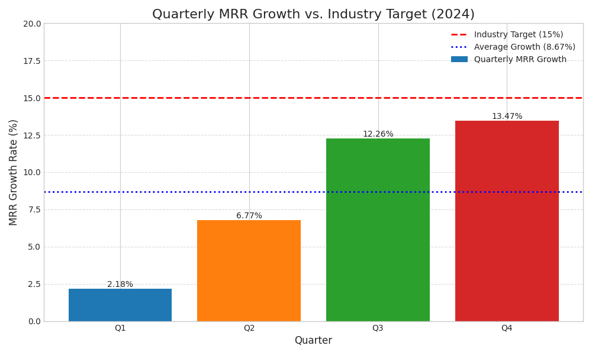

# Quarterly Performance Analysis: A Data Story

This repository contains an analysis of the Monthly Recurring Revenue (MRR) growth for the year 2024. The analysis was performed with assistance from an LLM-powered tool to generate insights and recommendations.

## Data Analysis

The analysis is based on the following quarterly MRR growth data:

| Quarter | MRR Growth (%) |
|---|---|
| Q1 | 2.18 |
| Q2 | 6.77 |
| Q3 | 12.26 |
| Q4 | 13.47 |

The average MRR growth for 2024 is **8.67%**.

## Visualization

The following chart visualizes the quarterly MRR growth in comparison to the industry target of 15%.

## Key Findings

- **Positive Growth Trajectory:** The company has demonstrated a consistent and significant upward trend in MRR growth throughout the year.
- **Q4 Peak:** The highest growth was achieved in Q4, reaching 13.47%, which is close to the industry target.
- **Gap to Target:** Despite the positive trend, the average MRR growth of 8.67% is still below the industry benchmark of 15%.

## Business Implications

The current trend indicates that while the company is on a positive growth path, it is not yet competitive with the top performers in the industry. If this gap is not addressed, there is a risk of losing market share to competitors who are achieving higher growth rates.

## Recommendations

To bridge the gap and reach the 15% industry target, the following recommendations are proposed:

1.  **Expand into New Market Segments:** The most significant opportunity for growth lies in entering untapped markets. A strategic expansion can open up new revenue streams and accelerate MRR growth. This could involve targeting new geographic regions, customer demographics, or industry verticals.
2.  **Product Line Diversification:** Introduce new products or services that complement the existing offerings. This can increase the average revenue per customer and attract a wider customer base.
3.  **Enhance Customer Retention Strategies:** While acquiring new customers is important, retaining existing ones is equally crucial. Implementing loyalty programs, improving customer support, and actively seeking feedback can reduce churn and stabilize MRR.
4.  **Strategic Partnerships:** Collaborate with other businesses to reach a larger audience. Co-marketing campaigns, integrations, and reseller programs can be effective channels for growth.

## Verification

For any questions or verification, please contact: 24ds1000021@ds.study.iitm.ac.in
